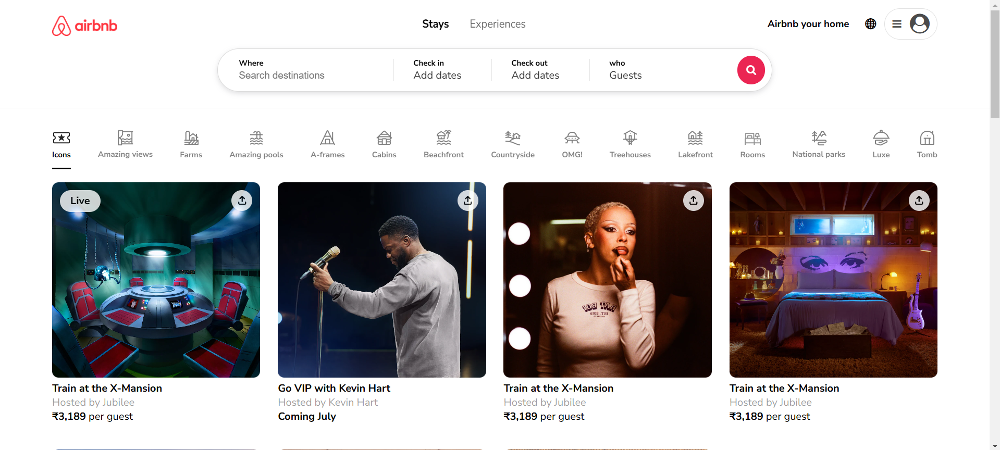
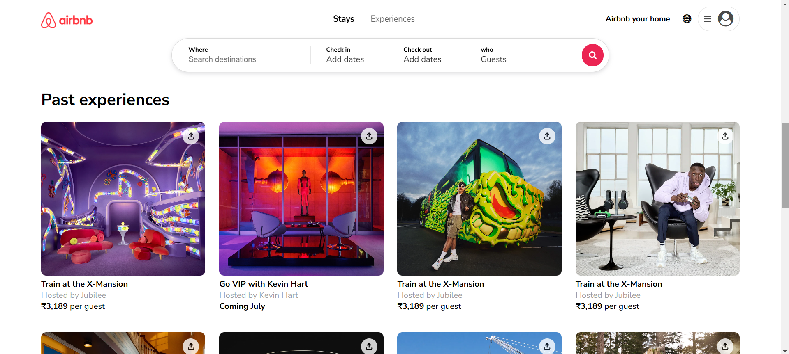

# 🏡 Airbnb Clone – Next‑Gen UI Web Project

A clean and modern **Airbnb Clone UI** built using **HTML & CSS**,<br> focusing on responsive design, real‑world UI layout, and modern web aesthetics.

---

## 👤 Author

**Hadil K K**
<br><br>🎓 BE – Computer Science & Engineering
<br>🏫 Kalaignarkarunanidhi Institute of Technology

---

## 📌 Project Overview

This project is a **frontend UI clone of Airbnb**, created to practice and demonstrate **modern UI design principles**, layout structuring, and responsive web development using core web technologies.

The goal of this project is to replicate the **look and feel of Airbnb’s interface**, including cards, navigation, icons, and layout alignment while keeping the code simple and readable.

---

## ✨ Features

* 🏠 Airbnb‑style homepage UI
* 📱 Fully responsive layout
* 🎨 Modern and clean UI design
* 🖼 High‑quality images and icons
* 🧭 Navigation bar similar to real Airbnb
* ⚡ Lightweight & fast loading

---

## 🧱 Tech Stack

* **HTML5** – Structure & content
* **CSS3** – Styling & layout
* **Flexbox & Grid** – Responsive design
* **Git & GitHub** – Version control

---

## 📂 Actual Project Structure

```
Airbnb-clone/
│
├── .github/               # GitHub related files
├── .git/                  # Git repository data
│
├── images/                # Property images & UI visuals
├── icons/                 # UI icons
├── screenshots/           # Project screenshots
│
├── index.html             # Main HTML file
├── style.css              # Main stylesheet
├── logo.png               # Project logo
├── favicon.png            # Browser favicon
├── README.md              # Project documentation
│
└── Airbnb-Clone/           # Additional project assets / backup
```

---

## 🧩 Module Explanation

### 1️⃣ `index.html` – Main UI Layout

This is the **core file** of the project.

**Responsibilities:**

* Defines the complete page structure
* Contains navbar, hero section, cards, and footer
* Links all styles, images, and icons

---

### 2️⃣ `style.css` – Styling & UI Design

Controls the **entire visual appearance** of the website.

**Includes:**

* Layout styling (Flexbox & Grid)
* Colors, fonts, and spacing
* Responsive media queries
* Hover effects and UI polish

---

### 3️⃣ `images/` – Property & UI Images

Stores all **property images and banners** used in the UI.

Purpose:

* Enhances visual appeal
* Simulates real Airbnb listings

---

### 4️⃣ `icons/` – UI Icons

Contains icons used for:

* Navigation
* Filters
* UI indicators

Improves user experience and clarity.

---

### 5️⃣ `screenshots/` – Project Preview

Includes screenshots of the UI for:

* GitHub preview
* Documentation
* Portfolio usage

---

### 6️⃣ `logo.png` & `favicon.png`

* **logo.png** → Branding of the project
* **favicon.png** → Browser tab icon

---
  
## 📸 Screenshots

Here are some screenshots of the project:




---

## ⚙️ How to Run the Project

```bash
# Clone the repository
git clone https://github.com/your-username/Airbnb-clone.git

# Open project folder
cd Airbnb-clone

# Open index.html in browser
```

(No backend or server required)

---

## 🚀 Future Improvements

* JavaScript interactivity
* Search & filter functionality
* Dark mode
* Backend integration
* Full‑stack Airbnb clone

---

## 📜 License

This project is licensed under the **MIT License**.

---

## 🙌 Acknowledgements

* Airbnb UI inspiration
* Open‑source community
* Kalaignarkarunanidhi Institute of Technology

---

⭐ **If you like this project, don’t forget to star the repository!**

